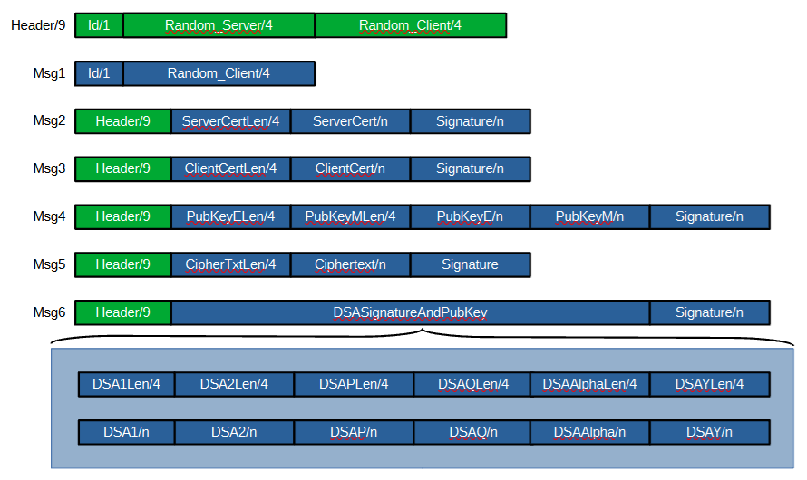

# crypto_prot
Basic cryptographic primitives implemented in Java, client-server protocol showcasing (parts of) these primitives.

## Preconditions

- OpenSSL installed
- OpenJDK 21 installed
- gradle 8.x installed, see https://gradle.org/install/ (Version 4.x, like installed on Ubuntu, won't work!)

## Build and run tests

Run `./gradlew build`. This will generate a self-signed root certificate, client and server certificates that are signed by the root certificate, as well as the associated keys. The certificates and keys are added to the client and server .jar files as resources in the subsequent compilation phase.

## Get unit test coverage via JaCoCo

Run `./gradlew test jacocoTestReport`

## Client-Server Protocol

The implemented RSA, DSA, SHA-1 primitives and the processing of certificates are used in the following client/server protocol. To avoid  cluttering the protocol, not all primitives were integrated, i.e. the
elliptic curve/hashing/HMAC/AES/Certificate functions were left out. Their usage is shown in the respective unit tests.

Client and Server exchange messages via localhost:12345/Tcp, should be visible on wireshark.

All multibyte message fields are serialized in Big-Endian byte order, i.e. MSB comes first, LSB comes last
The first message byte is `Id`, index of the message: 1..6. This is, except for message 1, followed by four random bytes generated by the server and four random bytes generated by the client. Message 1 only
transmits the four random bytes of the client. In the following, the sequence `Id`, `Random_Server`, and `Random_Client` is referred to as `Header`

Client and Server generate the trailing `Signature` field by signing all message bytes using the private key of their certificate.
In messages 2 and 3 the peers transmit their own certificate which is then validated by the other side for:
- Correct subject name
- Validity of certificate (not expired yet, already valid)
- Signature of certificate by root certificate

In message 4, the server transmits its RSA public key. In message 5, the client generates a `Ciphertext` out of a secret message using that key and sends it back to the server.

The server decrypts the `Ciphertext`, prints the clear text on the console, then signs the clear text with its DSA key pair, and sends the signature and the public DSA key back to the client in message 6. The client verifies the validity of the signature against the clear text and reports whether the verification
was successful or not. The following diagram shows the layout of the messages:

To run the protocol:
- Run server via gradlew `./gradlew :server:run`.
- Run client via gradlew: `./gradlew :client:run --args <secret message>`, e.g. `./gradlew :client:run --args "This is my secret message"`

## Source Code

### Primitives

- [AES.java](cryptolib/src/main/java/net/its26/AES.java): Symmetric encryption/decryption using AES 128 CBC; tests: [AESTest.java](cryptolib/src/test/java/net/its26/AESTest.java)
- [Certificates.java](cryptolib/src/main/java/net/its26/Certificates.java): Certificate generation; tests: [CertificatesTest.java](cryptolib/src/test/java/net/its26/CertificatesTest.java)
- [Common.java](cryptolib/src/main/java/net/its26/Common.java): commonly used functions; tests: [CommonTest.java](cryptolib/src/test/java/net/its26/CommonTest.java)
- [DSA.java](cryptolib/src/main/java/net/its26/DSA.java): DSA key generation, signing and verification; tests: [DSATest.java](cryptolib/src/test/java/net/its26/DSATest.java)
- [EC.java](cryptolib/src/main/java/net/its26/EC.java): EC scalar multiplication; tests: [ECTest.java](cryptolib/src/test/java/net/its26/ECTest.java)
- [Hash.java](cryptolib/src/main/java/net/its26/Hash.java): Generation of hashes using various functions; tests: [HashTest.java](cryptolib/src/test/java/net/its26/HashTest.java)
- [HMAC.java](cryptolib/src/main/java/net/its26/HMAC.java): Generation of HMAC ontop of SHA-256; tests: [HMACTest.java](cryptolib/src/test/java/net/its26/HMACTest.java)
- [RSA.java](cryptolib/src/main/java/net/its26/RSA.java): RSA key generation, decryption/encryption and padding; tests: [RSATest.java](cryptolib/src/test/java/net/its26/RSATest.java)
- [SHA1.java](cryptolib/src/main/java/net/its26/SHA1.java): Implementation of SHA-1, used in DSA; tests: [SHA1Test.java](cryptolib/src/test/java/net/its26/SHA1Test.java)

### Client/Server Protocol

- [genKeysAndCerts.sh](KeysAndCerts/genKeyAndCerts.sh): Script for generating certificates and keys used in the client-server protocol.
- [ClientServer.java](cryptolib/src/main/java/net/its26/ClientServer.java): implementation of client-server protocol, serialization, deserialization of frames; tests: [ClientServerTest.java](cryptolib/src/test/java/net/its26/ClientServerTest.java)
- [Client.java](./client/src/main/java/net/its26/Client.java): implementation of the client app
- [Server.java](./server/src/main/java/net/its26/Server.java): implementation of the server app

